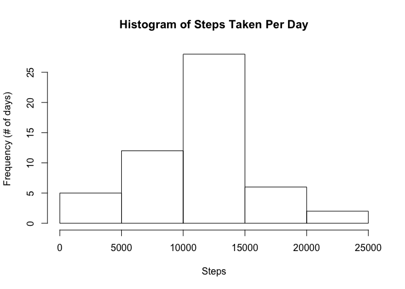
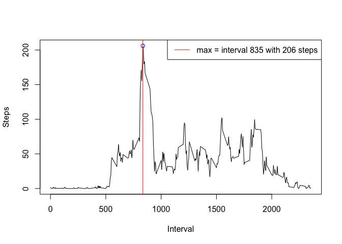
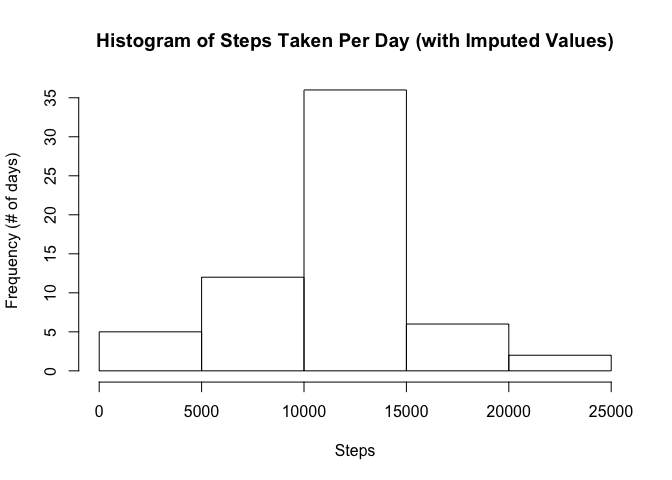
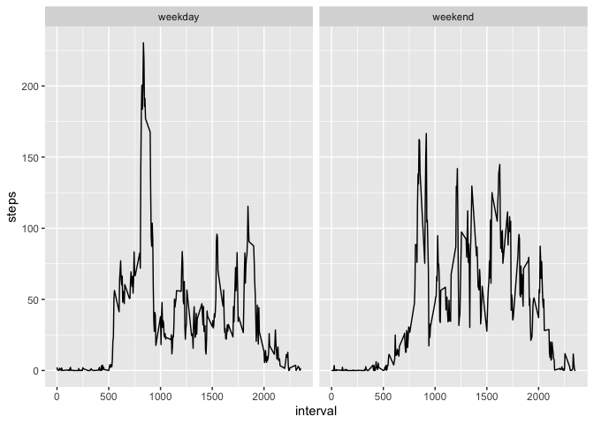

### Loading and preprocessing the data

Show any code that is needed to

1. Load the data (i.e. `read.csv()`)

2. Process/transform the data (if necessary) into a format suitable for your analysis

Read the data in R. The activitiy.zip file is already in the repository


```r
unzip("activity.zip")
activity <- read.csv("activity.csv")
head(activity)
```

```
##   steps       date interval
## 1    NA 2012-10-01        0
## 2    NA 2012-10-01        5
## 3    NA 2012-10-01       10
## 4    NA 2012-10-01       15
## 5    NA 2012-10-01       20
## 6    NA 2012-10-01       25
```
### What is mean total number of steps taken per day?

For this part of the assignment, you can ignore the missing values in
the dataset.

1. Make a histogram of the total number of steps taken each day

2. Calculate and report the **mean** and **median** total number of steps taken per day


```r
# Summarise to plot
library(dplyr)
```

```
## 
## Attaching package: 'dplyr'
```

```
## The following objects are masked from 'package:stats':
## 
##     filter, lag
```

```
## The following objects are masked from 'package:base':
## 
##     intersect, setdiff, setequal, union
```

```r
steps_taken_per_day <- summarise(group_by(activity, date), sum(steps))
colnames(steps_taken_per_day) <- c("date", "steps")

# Plot
hist(steps_taken_per_day$steps, xlab = "Steps", ylab = "Frequency (# of days)", main = "Histogram of Steps Taken Per Day")
```

<!-- -->

```r
#Calculate mean and median
mean_steps_taken_per_day <- as.integer(round(mean(steps_taken_per_day$steps, na.rm = TRUE), digits = 0)); 
median_steps_taken_per_day <- as.integer(round(median(steps_taken_per_day$steps, na.rm = TRUE), digits = 0));
```

The mean 10766 and median 10765 are already very close to one another, either could be a good measurement of central tendency.

### What is the average daily activity pattern?

1. Make a time series plot (i.e. `type = "l"`) of the 5-minute interval (x-axis) and the average number of steps taken, averaged across all days (y-axis)

2. Which 5-minute interval, on average across all the days in the dataset, contains the maximum number of steps?


```r
# Calculate interval means and summarise to plot
interval_means <- summarise(group_by(activity, interval), mean(steps, na.rm = TRUE))
colnames(interval_means) <- c("intervals", "steps")
head(interval_means)
```

```
## # A tibble: 6 x 2
##   intervals  steps
##       <int>  <dbl>
## 1         0 1.72  
## 2         5 0.340 
## 3        10 0.132 
## 4        15 0.151 
## 5        20 0.0755
## 6        25 2.09
```

```r
# Calculate max interval and average number of steps taken during max interval
max_interval <- as.numeric(interval_means[interval_means$steps == max(interval_means$steps), 1])
max_steps <- interval_means[interval_means$intervals == max_interval, ]
max_steps <- as.integer(round(max_steps$steps, digits = 0))

# Plot
with(interval_means, plot(intervals, steps, type = "l", xlab = "Interval", ylab = "Steps"))
abline(v = max_interval, col = "red")
points(max_interval, max_steps, col = "blue")
legend("topright", lty = 1, col = "red", legend = "max = interval 835 with 206 steps")
```

<!-- -->

The interval 835, on average, contained the maximum number of steps with an average of 206 steps.

### Imputing missing values

Note that there are a number of days/intervals where there are missing
values (coded as `NA`). The presence of missing days may introduce
bias into some calculations or summaries of the data.

1. Calculate and report the total number of missing values in the dataset (i.e. the total number of rows with `NA`s)

2. Devise a strategy for filling in all of the missing values in the dataset. The strategy does not need to be sophisticated. For example, you could use the mean/median for that day, or the mean for that 5-minute interval, etc.

3. Create a new dataset that is equal to the original dataset but with the missing data filled in.

4. Make a histogram of the total number of steps taken each day and Calculate and report the **mean** and **median** total number of steps taken per day. Do these values differ from the estimates from the first part of the assignment? What is the impact of imputing missing data on the estimates of the total daily number of steps?


```r
# Calculate number of missing values
NAs <- sum(is.na(activity$steps))

# Impute values using interval means
activity_imp <- activity
activity_imp$steps <- replace(activity_imp$steps, is.na(activity_imp$steps), interval_means$steps)
head(activity_imp)
```

```
##       steps       date interval
## 1 1.7169811 2012-10-01        0
## 2 0.3396226 2012-10-01        5
## 3 0.1320755 2012-10-01       10
## 4 0.1509434 2012-10-01       15
## 5 0.0754717 2012-10-01       20
## 6 2.0943396 2012-10-01       25
```

```r
# Summarise to plot
steps_taken_per_day_with_imputed_values <- summarise(group_by(activity_imp, date), sum(steps))
colnames(steps_taken_per_day_with_imputed_values) <- c("date", "steps")

# Plot
hist(steps_taken_per_day_with_imputed_values$steps, 
    xlab = "Steps", ylab = "Frequency (# of days)", 
    main = "Histogram of Steps Taken Per Day (with Imputed Values)")
```

<!-- -->

```r
# Calculate mean and median
mean_steps_taken_per_day_with_imputed_values <-  
    as.integer(round(mean(steps_taken_per_day_with_imputed_values$steps), digits = 0))
median_steps_taken_per_day_with_imputed_values <-
    as.integer(round(median(steps_taken_per_day_with_imputed_values$steps), digits = 0))
```

There were 2304 missing values. 

I followed an unsophisticated method for replacing the missing values with the mean for that five minute interval. 

- This increased the number of days with steps equal to the mean. 
- It did not change the mean, 10766, for the number of steps at all. 
- The median, 10766, which was already very close to the mean, became equal to the mean. 
- This did not remove any bias from the data; if there had been bias in the reported data, this method of imputing values just reinforced it.

### Are there differences in activity patterns between weekdays and weekends?

1. Create a new factor variable in the dataset with two levels -- "weekday" and "weekend" indicating whether a given date is a weekday or weekend day.

2. Make a panel plot containing a time series plot (i.e. `type = "l"`) of the 5-minute interval (x-axis) and the average number of steps taken, averaged across all weekday days or weekend days (y-axis).


```r
# Create new factor variable
activity_imp$weekday <- weekdays(as.Date(activity_imp$date))
activity_imp$weekday <- ifelse(activity_imp$weekday %in% c("Saturday", "Sunday"), "weekend", "weekday")

# Summarise to Plot
wdintervals <- summarise(group_by(activity_imp, interval, weekday), mean(steps))
colnames(wdintervals) <- c("interval", "weekday", "steps")

# Plot
# If ggplot2 is not installed, install ggplot2 from install.packages()
library(ggplot2)
g <- ggplot(wdintervals, aes(interval, steps))
g + geom_line() + facet_grid(. ~ weekday)
```

<!-- -->
